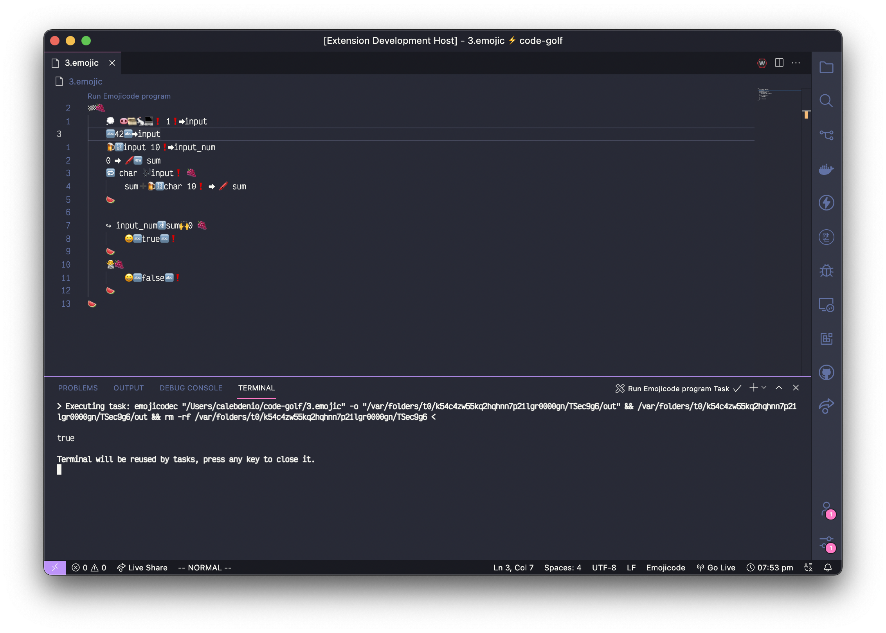

# Emojicode support in VS Code

This extension provides several utilities for working with [Emojicode](https://emojicode.org) programs in VS Code.

## Features

- Bracket highlighting
- Commenting/uncommenting
- Snippets
- Command for quickly running Emojicode programs

## Requirements

This extension requires an `emojicodec` binary on your `$PATH` for some features.